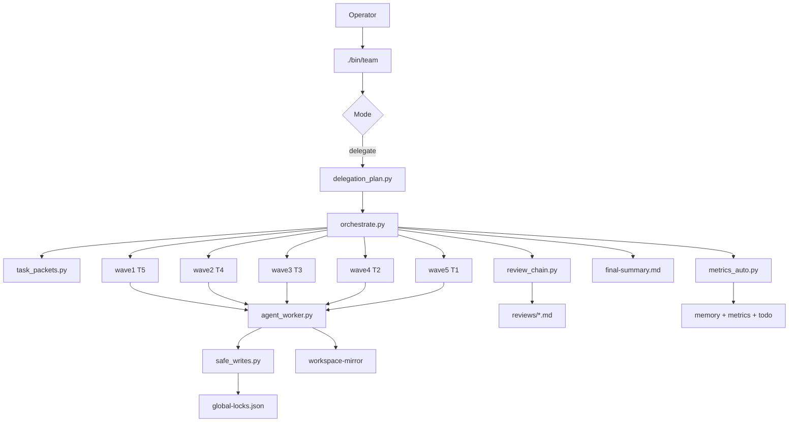
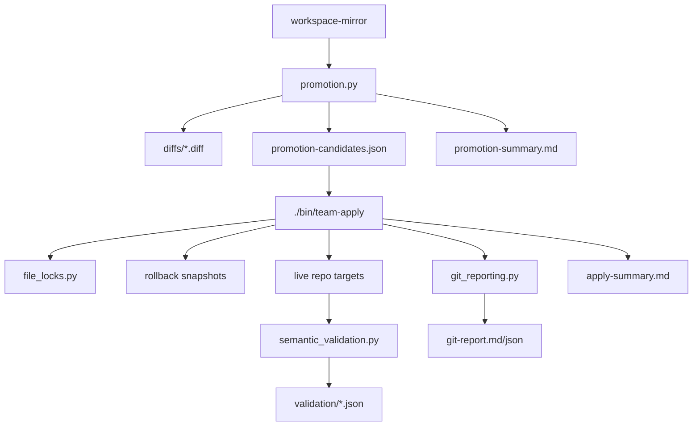
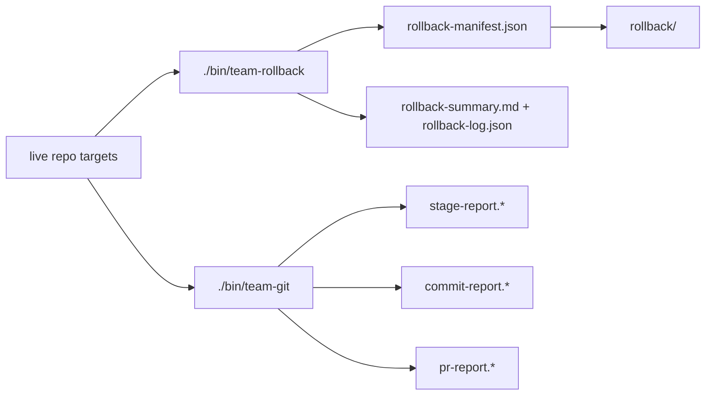

# Codex Multi-Agent Engineering Boilerplate

> v4.3.0 — minimal-root, Codex-first, enterprise-grade multi-agent engineering handbook

This repository is intentionally optimized for a **single-document root surface**. The root keeps only this `README.md` as the canonical operator document. All other operational assets live under `.codex/`.

This is deliberate.
It reduces:
- drift
- duplicated documentation
- maintenance overhead
- noisy root-level onboarding

It improves:
- source-of-truth clarity
- operator consistency
- long-term package maintainability

---

## Handbook Positioning

This README is intentionally the **single root handbook** for the package.

It serves:
- individual contributors
- team leads
- reviewers
- rollout owners

Its job is to explain:
- what the system is
- how it behaves by default
- how the runtime actually works today
- what is guaranteed vs environment-dependent
- where the deeper operational assets live under `.codex/`

---

## Executive Summary

This package is a structured operating system for serious engineering work with:
- multi-agent delegation
- tiered review
- project context discovery
- context-discipline by default
- topology-first narrowing by default
- compressed output by default
- hook-assisted safety
- contracts, checklists, memory, metrics, and runtime artifacts

Default-active operating baseline:
- `/caveman`
- `/context-mode`
- `/graphify`

Scaling control:
- `xN` -> agent scale selector

So a short prompt like:

```text
Auth feature x10
```

should be interpreted operationally closer to:

```text
/context-mode /graphify /caveman Auth feature x10
```

unless one of those modes is explicitly disabled.

---

## Current Runtime Truth

The package now includes a **real local orchestration runtime** behind delegate mode.

When invoked through:

```bash
./bin/team delegate "<task> xN"
```

the system can:
- parse `xN`
- generate per-tier task packets
- execute real parallel local subprocess workers in waves
- emit per-agent task reports
- emit review-chain artifacts
- stage safe writes into `workspace-mirror/`
- produce promotion candidates and per-file diffs
- apply approved changes back to the live repo
- create rollback snapshots and rollback manifests
- run semantic validation after apply
- emit git-aware reports after apply
- support follow-up stage / commit / PR workflow helpers

### Important truth boundary

This runtime is **real** in the following sense:
- real local subprocess execution
- real persisted packets/reports/reviews
- real retry/revision bookkeeping
- real apply / rollback / validation artifacts
- real git-facing helper workflows

But it is **not** currently:
- a hosted remote LLM sub-agent mesh
- a guarantee of external model/provider availability
- a misuse-proof autonomous production swarm
- a guaranteed PR creator on non-supported remotes

Example: GitHub PR creation support exists through `gh`, but it depends on the repo remote actually being a GitHub host and the local environment being authenticated.

---

## Strong Areas and Caveats

### Strong areas
- explicit multi-agent tier model
- explicit review chain
- explicit PCD model
- wrapper-based entrypoints
- contract-driven runtime artifacts
- approval-gated promote/apply pipeline
- rollback and validation support
- metrics and memory auto-update after serious runs

### Environment-dependent caveats
- model availability depends on the target runtime/account
- hook enforcement depends on wrapper/CI adoption
- Graphify quality depends on graph freshness/availability
- PR creation depends on remote host compatibility and auth
- optional validators such as `shellcheck` or markdown lint tooling may be unavailable and therefore degrade gracefully

---

## Root Policy

At the root level, keep only:
- `README.md`

Everything else belongs in `.codex/`.

---

## Default Active Modes

Unless explicitly turned off, these are treated as active by default:
- `/caveman`
- `/context-mode`
- `/graphify`

### Meaning
- output should be compressed by default
- repo exploration should be context-disciplined by default
- topology-first narrowing should be preferred where useful

### Turn-off examples
- `context-mode off`
- `graphify off`
- `no caveman`

---

## Delegation Model

### Canonical rule
- `xN` selects delegation scale
- `/delegate` explicitly requests multi-agent decomposition
- preferred explicit form:

```text
/delegate [task] xN
```

### Fixed modes
- `x2` -> quick discovery + senior gate
- `x3` -> small bounded feature
- `x4` -> medium feature
- `x5` -> standard production feature
- `x7` -> parallel feature/test/analysis/review
- `x10` -> migration, audit, or broad refactor

### Current runtime feature set
The local delegate runtime currently supports all of the following in one flow:
- per-tier packet generation
- wave-based parallel subprocess execution
- review-chain artifact generation
- safe file-writing into a sandboxed `workspace-mirror/`
- revision-loop retries up to 2 rounds
- fallback / escalation visibility when revision loops are exhausted
- automatic metrics updates
- automatic serious-session memory/resume/todo updates
- approval-ready promotion artifacts for mirror changes
- approval-based live apply via `./bin/team-apply`
- rollback via `./bin/team-rollback`
- git-aware reports via `git-report.*`
- follow-up stage / commit / PR helper flows via `./bin/team-git`
- repo-wide global lock management for competing target paths

### Runtime artifact tree
Each delegate run writes artifacts under:

```text
.codex/runtime/runs/<run_id>/
  manifest.json
  final-summary.md
  promotion-summary.md
  promotion-candidates.json
  apply-summary.md
  rollback-manifest.json
  rollback-summary.md
  rollback-log.json
  git-report.md
  git-report.json
  stage-report.md
  stage-report.json
  commit-report.md
  commit-report.json
  pr-report.md
  pr-report.json
  packets/
  agents/
  reviews/
  logs/
  diffs/
  apply-logs/
  validation/
  rollback/
  workspace-mirror/
```

### Practical default model
If you give only:

```text
Task x10
```

then the expected interpretation is effectively:
- default modes active
- x10 scale active
- analysis/review/decomposition should be assumed where appropriate

---

## Tier Model

- Orchestrator / T1 Principal -> `gpt-5.4` (high)
- T2 Staff Engineer -> `gpt-5.3-codex` (high)
- T3 Mid Coder -> `gpt-5.2` (medium)
- T4 Lead Analyst -> `gpt-5.2` (high)
- T5 Analyst -> `gpt-5.2` (high)

### Role intent
- Orchestrator -> communication, routing, consolidation
- T1 -> architecture and final review
- T2 -> complex implementation and upper implementation review
- T3 -> bounded implementation
- T4/T5 -> discovery, evidence, analysis, consolidation

---

## Review Chain

Canonical upward flow:
- T5 output -> reviewed by T4
- T3 output -> reviewed by T2
- T2 output -> reviewed by T1
- Orchestrator -> consolidates and reports

Structured review output contract:
- `.codex/contracts/review-report.md`

---

## Project Context Discovery (PCD)

Use PCD on unfamiliar or large work.

Expected PCD output:
- project goal
- module map
- constraints and conventions
- likely affected files
- recommended next reads

Primary references:
- `.codex/instructions/reference/project-context-discovery.instructions.md`
- `.codex/docs/project-context-discovery.md`

---

## Context Mode

Use `/context-mode` when:
- repo is large
- task surface is wide
- over-reading is likely
- summary-first exploration is needed

Core behavior:
- narrow with search first
- read only relevant sections
- summarize findings compactly
- explicitly note what was intentionally not read yet

---

## Graphify

Use `/graphify` when:
- dependency surface is large
- hotspot detection matters
- topology-first narrowing is useful

Core behavior:
- check graph freshness
- query hotspots/boundaries
- read narrowed files
- report EXTRACTED / INFERRED / AMBIGUOUS

---

## Caveman

Use `/caveman` to reduce prose verbosity without changing meaning.

Modes:
- `/caveman`
- `/caveman lite`
- `/caveman full`
- `/caveman ultra`

Preservation rules:
- never compress code
- never compress commands, paths, warnings, or errors
- never compress irreversible or consent-critical wording

---

## Architecture Overview

The current runtime can be understood as four connected layers:
- wrapper/operator entrypoints
- delegate orchestration runtime
- approval-gated apply/rollback pipeline
- git-facing post-apply helpers

### Runtime architecture diagram



### Approval and promotion diagram



### Rollback and git-helper diagram



### Interpretation
- `./bin/team delegate` drives orchestration and artifact generation.
- workers never write directly to the live repo during delegate execution; they write into `workspace-mirror/`.
- promotion/apply is a second explicit step.
- rollback is a third explicit step.
- git stage/commit/PR helpers are optional follow-up operator actions.

## Real Delegate Runtime Walkthrough

This section describes the **actual runtime behavior** behind `delegate` mode.

### High-level lifecycle
When you run:

```bash
./bin/team delegate "approval-based live apply / promote pipeline ekle x10"
```

the system performs these stages:

1. wrapper validates mode and prompt shape
2. delegation plan is rendered
3. runtime parses `xN` and builds tier packets
4. packets are executed in waves
5. each worker emits a task report
6. reviewer tiers emit review reports
7. safe writes go to `workspace-mirror/` instead of the live repo
8. unified diffs and promotion candidates are generated
9. optional apply promotes approved mirror files back to live targets
10. rollback snapshots are created before live apply
11. post-apply semantic validation runs
12. git-aware reports are emitted
13. metrics/session/resume/todo files are auto-updated for serious runs

### Wave model
The runtime currently uses this effective sequence:
- `wave1-discovery` -> T5
- `wave2-consolidation` -> T4
- `wave3-implementation` -> T3
- `wave4-staff-review` -> T2
- `wave5-principal-review` -> T1
- `wave6-consolidation` -> orchestrator

### xN distribution examples

#### `x3`
- T5: 1
- T4: 0
- T3: 0
- T2: 1
- T1: 1

Example:
```bash
./bin/team delegate "auth feature x3"
```

#### `x5`
- T5: 1
- T4: 1
- T3: 1
- T2: 1
- T1: 1

Example:
```bash
./bin/team delegate "notification refactor x5"
```

#### `x10`
- T5: 2
- T4: 2
- T3: 2
- T2: 2
- T1: 2

Example:
```bash
./bin/team delegate "platform migration audit x10"
```

Expected use:
- migration
- broad refactor
- heavy audit
- high review pressure

### Example: successful delegate run
```bash
./bin/team delegate "update README.md and AGENTS.md x5"
```

Typical artifact families:
- `manifest.json`
- `agents/*.md`
- `reviews/*.md`
- `promotion-summary.md`
- `promotion-candidates.json`
- `diffs/*.diff`

### Example: revision-loop scenario
```bash
./bin/team delegate "force-revision runtime write update README.md x5"
```

What this demonstrates:
- review reports can return `Revision Required`
- the same packet can retry up to 2 more times
- exhausted loops are logged as fallback/escalation rows
- fallback visibility is preserved in final summary and metrics

Typical artifacts:
- `reviews/*-r0.md`
- `reviews/*-r1.md`
- `reviews/*-r2.md`
- fallback rows in `.codex/metrics/fallback-log.md`

---

## Safe File-Writing Model

Workers do **not** directly modify the live repository during runtime execution.
They write to:

```text
.codex/runtime/runs/<run_id>/workspace-mirror/
```

Write policy is tier-scoped:
- T5 -> raw analysis/runtime-owned surfaces only
- T4 -> consolidation/contracts-oriented surfaces
- T3 -> bounded implementation-safe surfaces and mirror outputs
- T2 -> broader config/contracts/docs surfaces
- T1 -> highest review/architecture scope including selected root docs

Write policy decisions are logged under:
- `.codex/runtime/runs/<run_id>/logs/write-policy-T*.json`

---

## Repo-Wide Global Lock Manager

The runtime now keeps a shared repo-wide lock registry under:

```text
.codex/runtime/global-locks.json
```

Purpose:
- prevent competing runs from silently staging/applying to the same target path
- make lock ownership explicit
- preserve run-local lock snapshots for diagnostics

Run-local diagnostic lock snapshots are still written to:
- `.codex/runtime/runs/<run_id>/locks.json`

This means lock scope is no longer only per-run.
It is coordinated across the repo runtime surface.

---

## Approval-Ready Promotion Model

Mirror changes are not auto-applied to live repo targets.
The runtime emits:
- `promotion-summary.md`
- `promotion-candidates.json`
- per-file unified diffs under `diffs/`

Example approval summary entry:

```text
- target: README.md | mirror: workspace-mirror/README.md | diff: diffs/README.md.diff | approval_required: yes
```

---

## Approval-Based Live Apply

After a run produces promotion candidates, you can explicitly apply approved targets:

```bash
./bin/team-apply <run_id> --approve README.md
./bin/team-apply <run_id> --approve-all
```

Example:

```bash
./bin/team-apply 2026-05-22T11-31-18Z --approve-all
```

The apply step:
- reads `promotion-candidates.json`
- copies approved mirror content back onto the live target
- writes machine-readable logs under `apply-logs/`
- writes `apply-summary.md`
- takes rollback snapshots before writing live targets
- writes `rollback-manifest.json`
- writes post-apply validation artifacts under `validation/`
- runs semantic validation for markdown/json/python/shell targets
- emits git-aware apply reports (`git-report.md`, `git-report.json`)
- uses the repo-wide lock manager to avoid same-target collisions

Git-aware reports:
- `git-report.md`
- `git-report.json`

---

## Rollback

Rollback examples:

```bash
./bin/team-rollback 2026-05-22T11-31-18Z --target README.md
./bin/team-rollback 2026-05-22T11-31-18Z --all
```

Rollback behavior:
- reads `rollback-manifest.json`
- restores selected live targets from snapshots under `rollback/`
- writes `rollback-summary.md`
- writes `rollback-log.json`

---

## Semantic Validation

Post-apply validation currently includes best-effort file-type-aware checks.

### Markdown
- non-empty check
- basic structure check
- optional markdown lint integration when available

### JSON
- parse validation
- parsed structure sanity

### Python
- compile validation
- best-effort safe import smoke for low-risk cases

### Shell
- `bash -n`
- `shellcheck` when available

Unavailable optional tools degrade gracefully and are reported as skipped/unavailable rather than crashing the apply pipeline.

---

## Git Workflow Helpers

After apply, you can run git-facing helper commands.

### Stage approved targets
```bash
./bin/team-git stage 2026-05-22T11-31-18Z README.md AGENTS.md
```

### Commit staged changes
```bash
./bin/team-git commit 2026-05-22T11-31-18Z "chore: apply approved runtime promotions"
```

### Prepare a PR request (GitHub CLI path, dry-run oriented)
```bash
./bin/team-git pr 2026-05-22T11-31-18Z "Apply runtime promotions" "Approval-gated changes from runtime run"
```

Artifacts:
- `stage-report.md`
- `stage-report.json`
- `commit-report.md`
- `commit-report.json`
- `pr-report.md`
- `pr-report.json`

### Important PR caveat
The PR helper currently relies on `gh pr create`.
If the repository remote is not a known GitHub host, or if auth is not configured, PR creation will not succeed and the failure will be captured in `pr-report.*`.

---

## Metrics and Serious-Session Auto-Updates

After serious delegate runs, the runtime auto-updates:
- `.codex/metrics/token-usage.md`
- `.codex/metrics/agent-performance.md`
- `.codex/metrics/leaderboard.md`
- `.codex/metrics/fallback-log.md`
- `.codex/memory/sessions/`
- `.codex/memory/resume/last-session.md`
- `.codex/todo/active-plan.md`

---

## Hooks

Hook scripts live under `.codex/hooks/`.

Important runtime truth:
- hooks exist
- enforcement depends on wrapper/CI/runtime wiring
- advisory persistence hooks degrade safely in restricted environments

Examples:
- `git-safety-check.sh`
- `context-mode-guard.sh`
- `graphify-audit.sh`
- `review-tracker.sh`
- `self-learning-collector.sh`

---

## Simple Command UX

For day-to-day usage, operators should not need to remember `./bin/...` paths, and they should not need to prefix every task with `delegate`, `codex`, or another orchestration keyword.

### Recommended shell integration
Source the runtime shell integration once from your shell rc file:

```bash
source /absolute/path/to/Codex/.codex/runtime/shell_integration.sh
```

Or install the simple CLI helper first:

```bash
bash .codex/scripts/install_simple_cli.sh
```

### Prompt-first usage
After sourcing shell integration, the main entrypoint becomes:

```bash
run "<prompt>"
```

Examples:

```bash
run "pcd repo analizi"
run "caveman auth akis ozeti"
run "notification refactor x5"
run "approval-based live apply pipeline ekle x10"
```

### Routing rules
The shell integration routes automatically when either of these is true:
- the prompt starts with a known keyword such as `pcd`, `context`, `graphify`, `caveman`, `review`, `delegate`, `apply`, `rollback`, or `git`
- the prompt contains `x2`, `x3`, `x4`, `x5`, `x7`, or `x10`

### What this means in practice
- `run "pcd repo analizi"` -> `pcd`
- `run "caveman bu ozeti kisalt"` -> `caveman`
- `run "auth feature x3"` -> auto-`delegate`
- `run "platform migration audit x10"` -> auto-`delegate`

### Important truth
A shell cannot intercept arbitrary plain text that is typed without **any** command at all.
So fully bare input like only:

```text
repo analizi x10
```

will not execute unless it is wrapped by a shell function or alias such as:

```bash
run "repo analizi x10"
```

That is a shell limitation, not a project limitation.

### Optional convenience aliases
After sourcing the integration, these also exist:

```bash
pcd repo analizi
context auth flow daralt
graphify high coupling module boundaries
caveman bu ozeti kisalt
review son degisiklikleri kontrol et
```

### Apply / rollback / git helpers
The same prompt-first integration also supports these helper families:

```bash
run "apply <run_id> --approve-all"
run "rollback <run_id> --all"
run "git stage <run_id> README.md AGENTS.md"
run "git commit <run_id> chore: apply approved runtime promotions"
run "git pr <run_id> Apply runtime promotions Approval-gated changes from runtime run"
```

If you still want a direct command name, `codex` remains available as an optional fallback, but the recommended human workflow is prompt-first `run "..."`.

---

## Team Wrappers and Commands

### Main team entrypoint
```bash
./bin/team <mode> "<prompt>"
```

### Supported team modes
- `pcd`
- `context`
- `graphify`
- `delegate`
- `review`
- `caveman`

### Convenience command
```bash
./bin/ctx "analyze auth flow and keep reads minimal"
```

### Apply / rollback / git helpers
```bash
./bin/team-apply <run_id> --approve README.md
./bin/team-rollback <run_id> --target README.md
./bin/team-git stage <run_id> README.md AGENTS.md
./bin/team-git commit <run_id> "chore: apply approved runtime promotions"
./bin/team-git pr <run_id> "Apply runtime promotions" "Approval-gated changes from runtime run"
```

### Strict delegate enforcement
```bash
CODEX_STRICT_DELEGATE=1 ./bin/team delegate "build notification preferences x5"
```

---

## Skills

Reusable capabilities are stored under `.codex/skills/`.

Examples:
- analysis
- context-mode
- graphify
- caveman
- code-review
- implementation
- backend-development
- frontend-development
- testing-standards
- security-check

---

## Contracts and Checklists

Core structured artifacts:
- `.codex/contracts/task-report.md`
- `.codex/contracts/review-report.md`
- `.codex/contracts/session-summary.md`
- `.codex/contracts/handoff-summary.md`
- `.codex/contracts/fallback-event.md`
- `.codex/contracts/task-packet.md`
- `.codex/contracts/run-summary.md`
- `.codex/contracts/promotion-approval.md`

Core process checklists:
- `.codex/checklists/pre-task.md`
- `.codex/checklists/post-task.md`
- `.codex/checklists/agents-contract-checklist.md`

---

## Operational Validation

If you want to verify the package is healthy, inspect:
- `.codex/docs/runtime-preflight.md`
- `.codex/docs/system-verification.md`
- `.codex/config/hook-registry.md`
- `.codex/instructions/reference/slash-commands.instructions.md`
- `.codex/instructions/reference/review-chain.instructions.md`
- runtime artifacts under `.codex/runtime/runs/<run_id>/`

And for wrapper usage governance:
- `.codex/scripts/wrapper_usage_summary.py`
- `.codex/scripts/wrapper_usage_markdown_report.py`
- `.codex/scripts/wrapper_usage_trend_analyzer.py`
- `.codex/scripts/wrapper_dashboard_report.py`
- `.codex/scripts/wrapper_health_check.py`
- `.codex/scripts/wrapper_flow_validator.py`

---

## Recommended Operator Examples

Quick bounded work:
```bash
./bin/team delegate "auth feature x3"
```

Balanced production lane:
```bash
./bin/team delegate "notification preference refactor x5"
```

Broad migration/audit lane:
```bash
./bin/team delegate "platform migration audit x10"
```

Promotion/apply lane:
```bash
./bin/team delegate "update README.md and AGENTS.md x10"
./bin/team-apply 2026-05-22T11-31-18Z --approve-all
./bin/team-git stage 2026-05-22T11-31-18Z README.md AGENTS.md
```

Rollback lane:
```bash
./bin/team-rollback 2026-05-22T11-31-18Z --target README.md
```

GitHub PR helper lane:
```bash
./bin/team-git pr 2026-05-22T11-31-18Z "Apply runtime promotions" "Approval-gated changes from runtime run"
```

---

## Final Guidance

If you change the operating model, update:
- this `README.md`
- the relevant `.codex/` source-of-truth docs
- any related contracts, wrappers, checks, runtime helpers, or verification docs

This keeps the package lean at the root while preserving depth internally.

<!-- runtime mirror update by T3 -->
